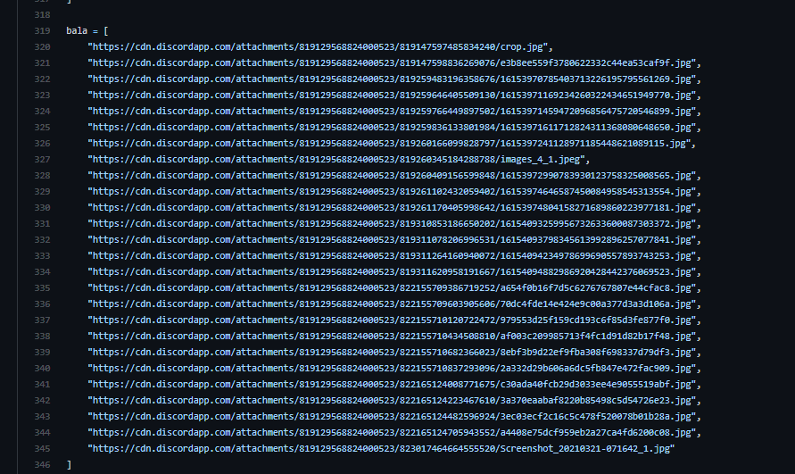

## Kayi Bot

1. clone the project with: ```git clone https://github.com/Submushf/Kayi-Bot.git```.
2. go to ```Kayi-Bot/cogs/picture.py ``` to add any new pictures of the characters 
3. example is given below 

Demo Image:
  